# **Graphical Curation Interface Tutorial ReadMe**
## Segmentation-Less, Automated, Vascular Vectorization (SLAVV)
### Methodology Overview
The SLAVV software ([supporting functions](https://github.com/UTFOIL/Vectorization-Public/blob/master/source)) gives the user the ability to curate the vectorization output with live visual feedback. This Graphical Curator Interface (GCI) automatically opens at the appropriate times during the default execution of the [main function](https://github.com/UTFOIL/Vectorization-Public/blob/master/vectorize_V200.m). The SLAVV method consists of four workflow steps as described in the [Methodology Manuscript](https://github.com/UTFOIL/Vectorization-Public#Methodology-Manuscript) section: Automated Vascular Vectorization:
1. linear "energy" filtering
2. vertex extraction
3. edge extraction
4. network organization

These steps must be executed sequentially, starting with the "energy" step. The input parameters for each specific workflow are described in the [Documentation](https://github.com/UTFOIL/Vectorization-Public#Documentation) section: **Workflow-Specific Parameters**. The graphical curator interface opens after the vertex and edge steps by default as described in the [Documentation](https://github.com/UTFOIL/Vectorization-Public#Documentation) section: **Logistical Parameters**.
## Tutorial Contents
This tutorial demonstrates the use of the graphical curator interface on three large (~1 mm3), images of living adult mouse brain microvasculature. The three images (**Image A**, **B**, and **C**) are all from the same mouse, approximately the same field of view, and timed 2 weeks apart. 
### Table of Contents
- [Input Images](#Input-images)
- [Energy Images](#Energy-images)
- [Curator Interface Overview](#GCI-Overview)
- [Vertex Curation](#Vertex-Curation)
  - [Global Thresholding](#Vertex-Global-thresholding)
  - [Local Thresholding](#Vertex-Local-Thresholding)
  - [Vertex Toggling](#Vertex-Toggling)
  - [Final Curated Vertex Set](Final-curated-Vertex-set)
- [Edge Curation](Edge-Curation)
  - [Global Thresholding](#edge-Global-Thresholding)
  - [Local Thresholding](#edge-Local-Thresholding)
  - [Orthogonal Views](#edge-orthogonal-views)
  - [Edge Toggling](#edge-toggling)
  - [Final Curated Edge Set](Final-curated-edge-set)
- [Projections](projections)
- [Histograms](histograms)
- [Visualizations](#visualizations)
<!---- [SLAVV Methodology Overview](#methodology-overview)
- [Inputs and Parameters](#Inputs-and-Parameters)
  - [Wrapper Script](#Wrapper-script)
- [Vertex Extraction](#Vertex-Extraction)-->

<!--The SLAVV methodology is described in the [Methodology Manuscript](https://github.com/UTFOIL/Vectorization-Public#Methodology-Manuscript). -->

### In the following screenshots, depictions of: 
**Image A** are in the left column | **Image B** the center | and **Image C** the right
:------------------------------------------- | :-------------------------------------------: | -------------------------------------------:
:------------------------------------------- | :-------------------------------------------: | -------------------------------------------:

<!--#### [This folder](https://github.com/UTFOIL/Vectorization-Public/blob/master/tutorial/) contains the screenshots demonstrating the use of the SLAVV software on **Images A**, **B**, and **C**.-->
<!--
## Inputs and Parameters
-->
## Input Images
To begin the vectorization process, input a raw TIF from a file location or a matrix from the MATLAB workspace into the [main function](https://github.com/UTFOIL/Vectorization-Public/blob/master/vectorize_V200.m), as described in the [Documentation](https://github.com/UTFOIL/Vectorization-Public#Documentation), section: **Optional Input**.

#### Maximum intensity projections of the first 100 microns of each of the three **input** image stacks:
A|B|C
:---: | :---: | :---:
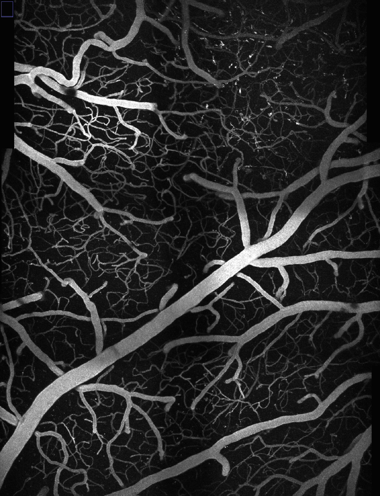||

There is no pre-processing (interpolation, filtering, etc.) required. The software will prompt the user for the size and shape of the voxels in microns.

## Energy Images
Default energy filtering processing parameters (purely Gaussian kernel) will work well for the images demonstrated here. If instead of the lumen, the vessel wall is illuminated, try starting with an 80/20 Gaussian/Ideal mixture, and a 50/50 annular/spherical ratio.

#### _Minimum_ intensity projection of the first 100 microns of each the three **energy-filtered** images:
A|B|C
:---: | :---: | :---:
||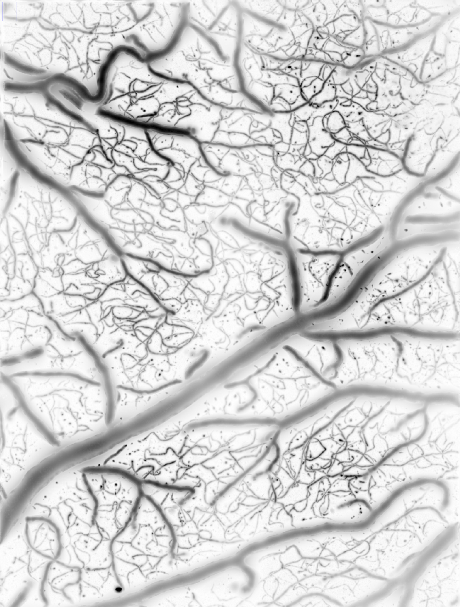

After running the first step ("energy") of the SLAVV workflow, vessels in the requested size range should have dark centerlines in the "energy" image.

<!--Images 1-2:
### Wrapper Script
Image A Input Selection | Starting Workflow Step Selection
:---: | :---:
|-->

## GCI Overview
The Graphical Curator Interface (GCI) has four windows (startig in top right and moving counter-clockwise):
1. [Volume Map](#Volume-Map)
2. [Volume Display](#Volume-Display)
3. [Intensity Histogram](#Intensity-Histogram)
4. [Energy Histogram])#Energy-Histogram)
#### Example Graphical Curator Interface (GCI)
A|B|C
:---: | :---: | :---:
||

This example curator screenshot shows how the curator looks when the user first opens the edge objects. The vectors shown are the unedited automatic output of the new (unreleased) version of the edge extraction step of SLAVV.

### Volume Map
The **Volume Map** window shows the user:
- the current 3D field of view (FOV) by highlighting the 2D projections on the face of the box.
- The dimensions of the entire 3D volumetric image on the axes of the box in real spatial dimensions.
- The voxel coordinates and total number of voxels in all 3 dimensions of the current FOV in a table.
- The volumes of influence of the previously applied threshold by painting red on the faces of the box.

### Volume Display
The **Volume Display** window shows the user:
- A maximum intensity projection of the original image and overlayed vetors in the current 3D FOV.
- The current depth of field in relation to the total possible depth of field in the two sliders.
- Which vector objects in the current field of view are status true (color:blue) or false (color:red).

The **Volume Display** window gives the user control over the current FOV:
- pan vertically and horizontally using the MATLAB panning tool for plots
- zoom vertically and horizontally using the MATLAB magnifying glass for plots
- navigate into/out-of the page using the depth scrollbar
- Increase/decrease the thickness of the FOV in the depth dimension

The **Volume Display** window also gives the user control over the direction of projection for the displayed MIP, (i.e. permute X, Y, and Z dimensions; change X or Y to the depth dimension (instead of Z)).

The **Volume Display** window gives the user vector object classification ("Toggling") ability to:
- (for Vertices)
  - point-and-click individual vertex to swap its true/false (blue/red) status,
  - drag a box around a group of vertices to change all of them to true/false (blue/red), and
- (for edges)
  - point-and-click individual edge to swap its true/false (blue/red).

### Intensity Histogram
The **Intensity Histogram** window shows the user the distribution of pixel-intensities in the FOV, allowing the user to:
- set brightness and contrast for the underlying original image, and
- toggle the dispaly mode between "original" and "inverted" for the underlying original image.

### Energy Histogram
The **Energy Histogram** window shows the user the distribution of vector-energies in the FOV, allowing the user to:
- set brightness and contrast of these objects accordingly,
- toggle the display mode between the "Graded" and "Binary" versions of the vector object brightnesses, and
- Set the energy threshold value, assigning all vectors above that energy value in the current FOV to false.

<!--Images 10's:-->
## Vertex Curation
Vertices have both point-location and radial-sizing components, and should be considered true (blue color in curator) when both the location and size match a vessel in the underlying original image. The user can curate (classify as true/false) the vertices using local thresholding as well as point-and-click toggling. 
### Vertex Global thresholding
A|B|C
:---: | :---: | :---:
some_text | some_text | some_text
||
||
||
||
|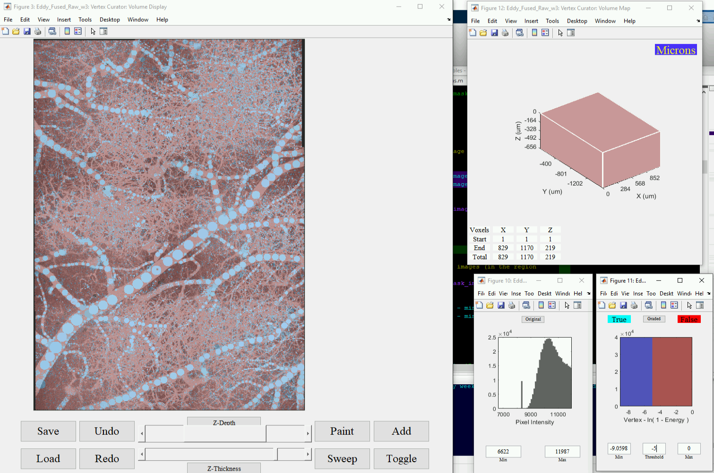|
||
||

<!--Images 20's:--> 
### Vertex Local Thresholding
A|B|C
:---: | :---: | :---:
||
||
||

### Vertex Toggling
|A|B|C
| :---: | :---: | :---:
|||
|||
|||
||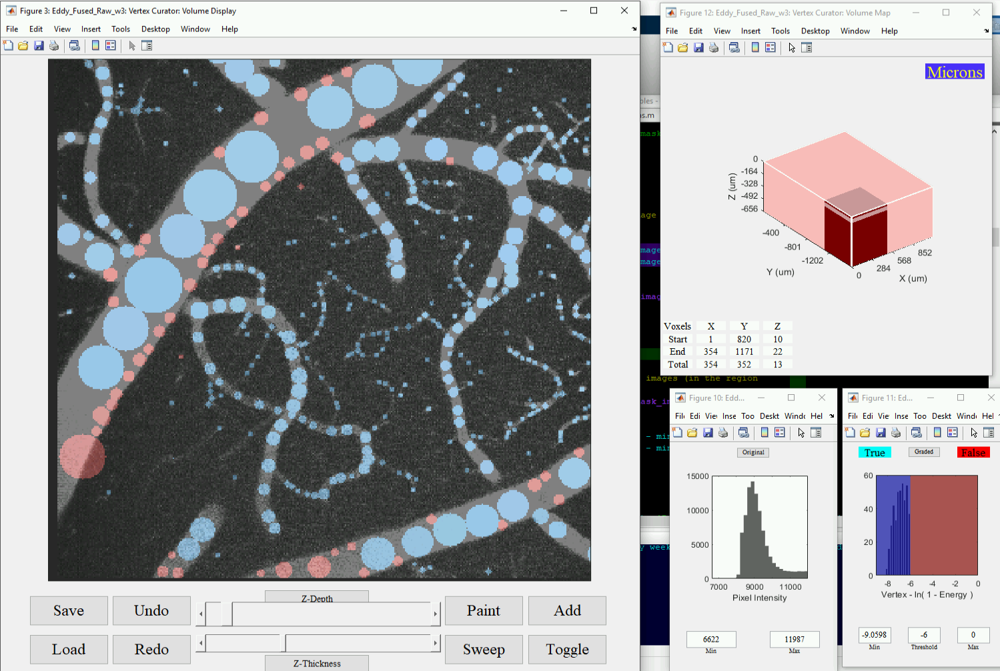|

<!--Image  30's: -->
### Final Curated Vertex Set
To be passed to the Edge Tracing step.
|A|B|C
| :---: | :---: | :---:
|||
|||

<!--Images 40's:-->
## Edge Curation
### Edge Global Thresholding
|A|B|C
| :---: | :---: | :---:
|||
||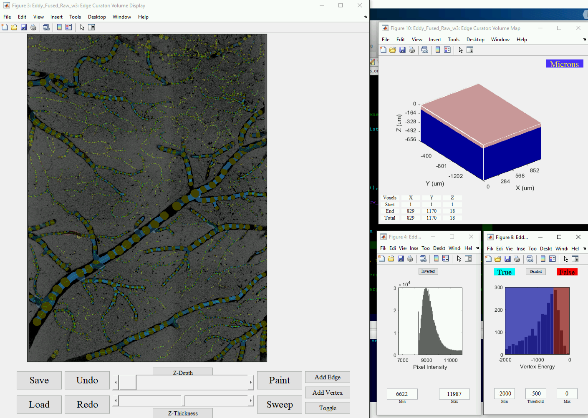|
|||
|||
|||
|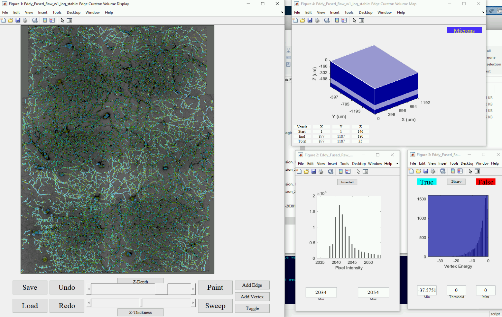||
|||
|||

### Edge Local Thresholding
|A|B|C
| :---: | :---: | :---:
|||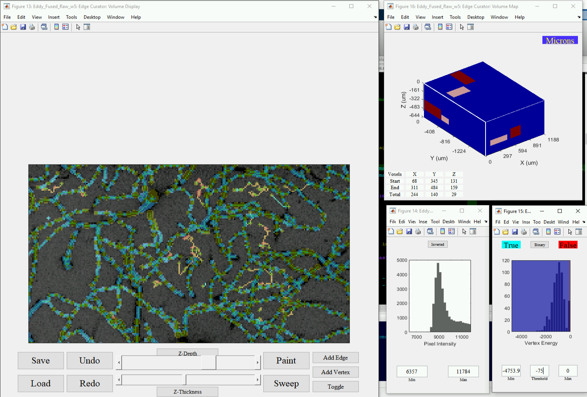

### Orthogonal Views
A|B|C
:---: | :---: | :---:
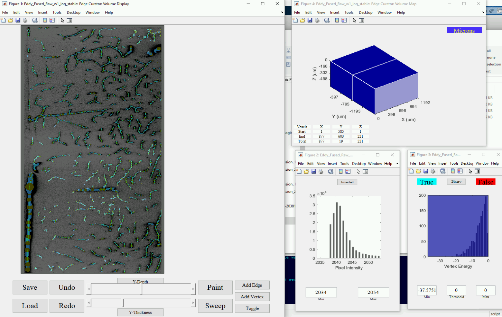||
||
||
||
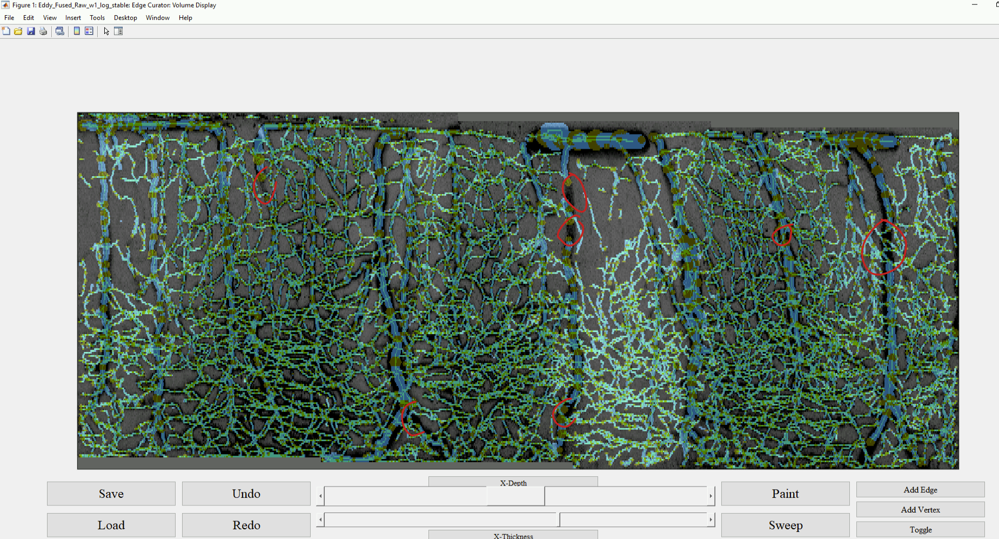||
### Edge Addition  
A|B|C
:---: | :---: | :---:
||
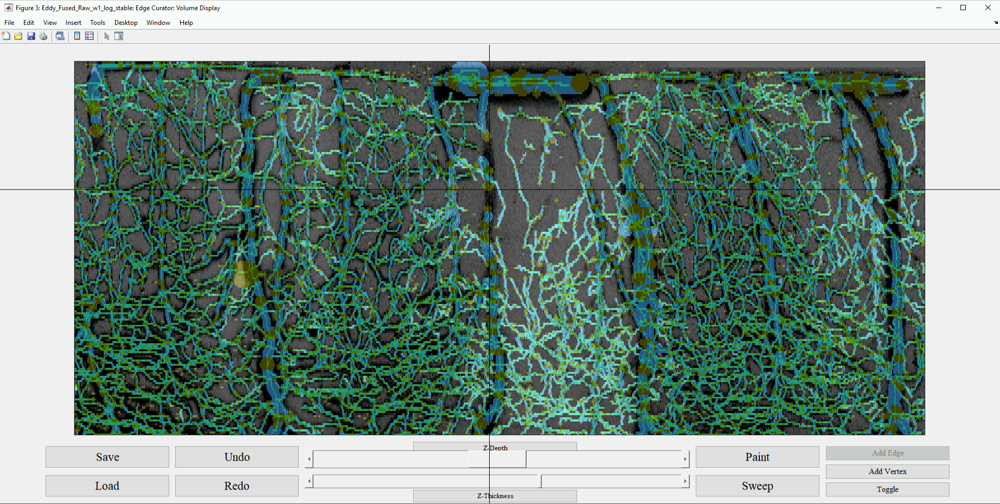||
||
||
### Edge Toggling

### Final Curated Edge Set 
#### MIP over the whole volume with graded edge color weighting.  
|A|B|C
| :---: | :---: | :---:
|||

### Projections
Maximum intensity projection outputs (Coloring: strand uniques, depth, and direction) from the middle (1/3 in all 3 dimensions) of the vectors overlaying the image.  
A|B|C
:---: | :---: | :---:
|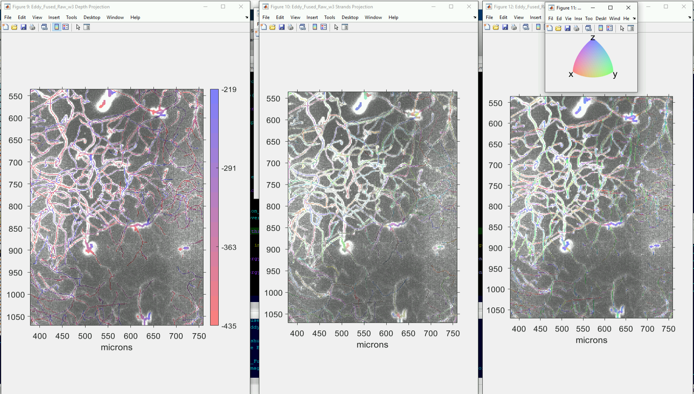|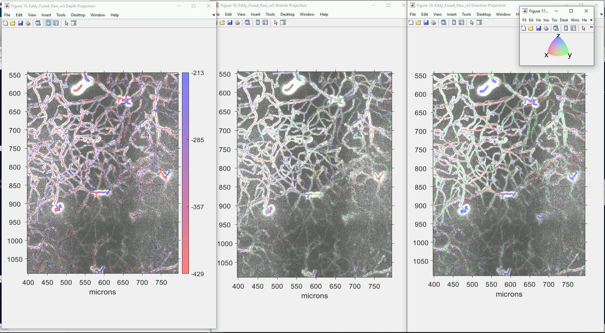

### Histograms 
of various statistics of interest from the vectors in the image.  
A|B|C
:---: | :---: | :---:
||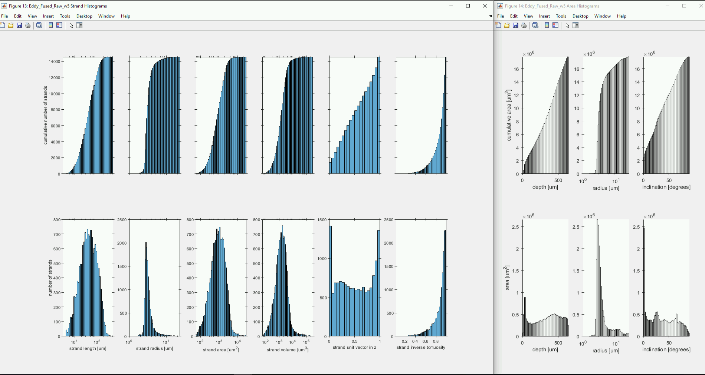

### Visualizations 
of the output vectors using a .vmv file output to the VessMorphoVis plugin to Blender.  

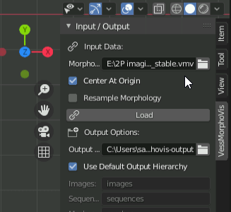

|A|B|C
|:---:|:---:|:---:
|||
|||
||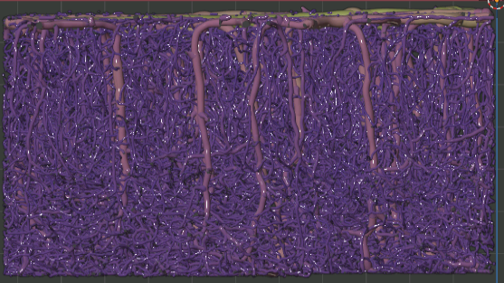|
|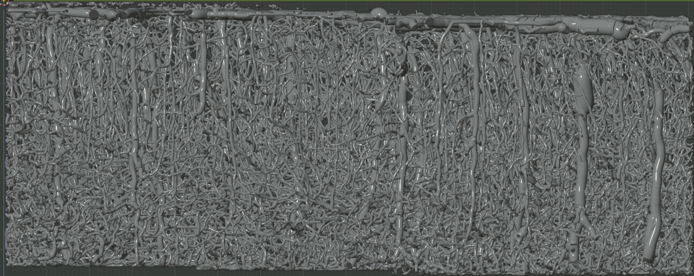||
|||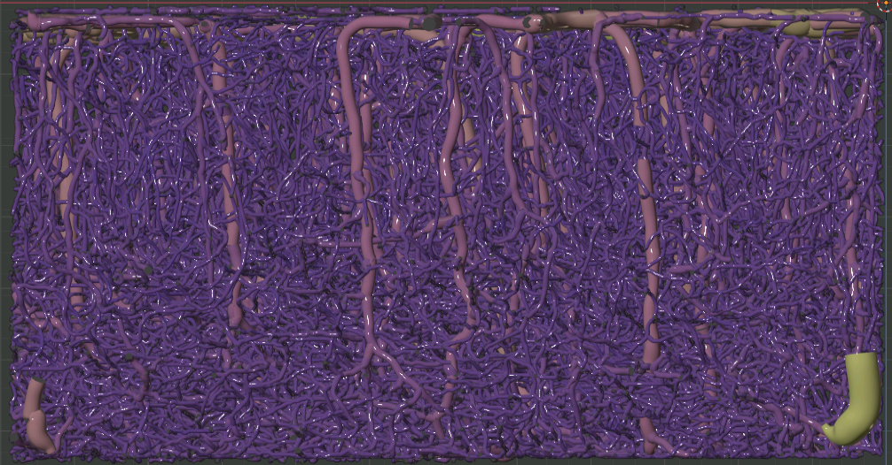
|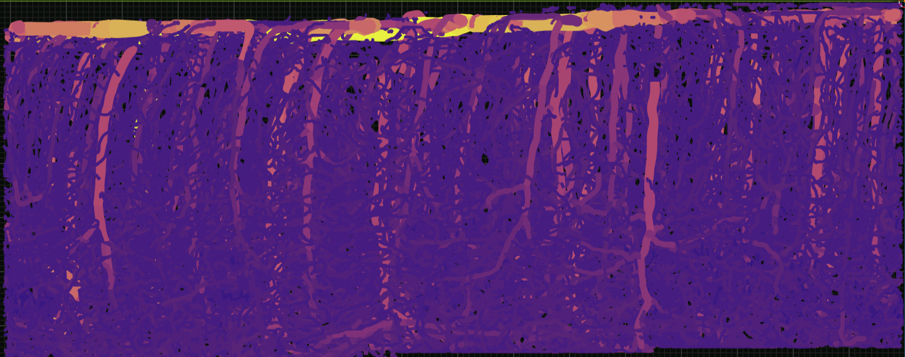|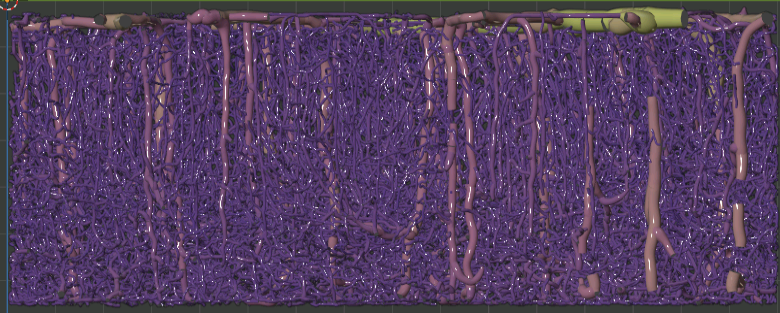|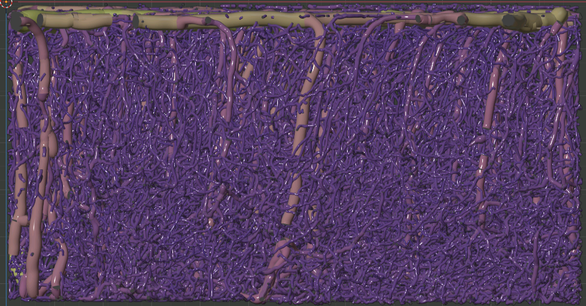

A|B|C
:---: | :---: | :---:
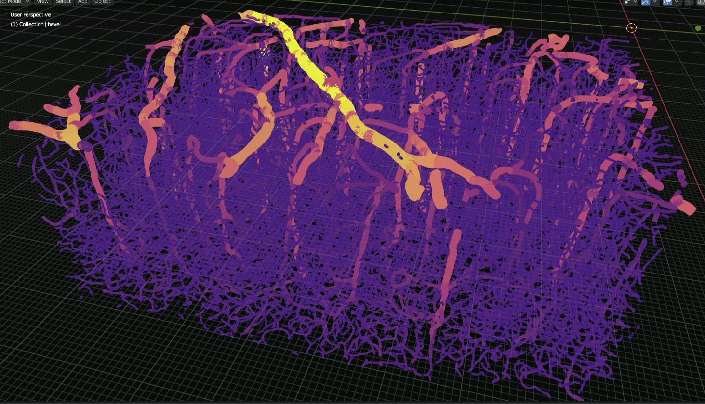||
||
||
||
||
||
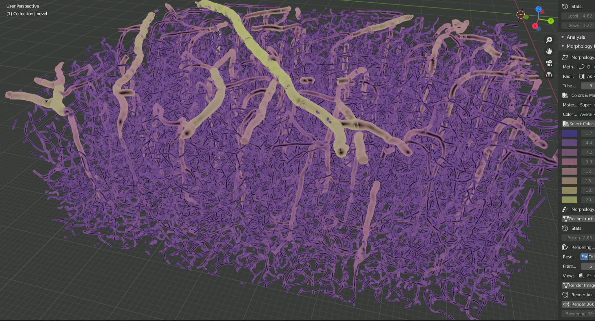||
||
