# **Graphical Curation Interface Tutorial ReadMe**
## Segmentation-Less, Automated, Vascular Vectorization (SLAVV)
### Methodology Overview
The SLAVV software ([Supporting Functions](https://github.com/UTFOIL/Vectorization-Public/blob/master/source)) gives the user the ability to curate the vectorization output with live visual feedback. This Graphical Curator Interface (GCI) automatically opens at the appropriate times during the default execution of the [Main Function](https://github.com/UTFOIL/Vectorization-Public/blob/master/vectorize_V200.m). The SLAVV method consists of four workflow steps as described in the [Methodology Manuscript](https://github.com/UTFOIL/Vectorization-Public#Methodology-Manuscript) Section: Automated Vascular Vectorization:
1. Linear "Energy" Filtering
2. Vertex Extraction
3. Edge Extraction
4. Network Organization

These steps must be executed sequentially, starting with the "energy" step. The input parameters for each specific workflow are described in the [Documentation](https://github.com/UTFOIL/Vectorization-Public#Documentation) Section: **Workflow-Specific Parameters**. The SLAVV software automatically extracts vertices and edges from the Energy Image, and automatically organizes the edges and vertices into a graph representation of the network. The [Graphical Curator Interface (GCI)](#GCI-Overview) opens after the Vertex and Edge Extraction steps by default as described in the Documentation Section: **Logistical Parameters**.
# Tutorial Contents
This tutorial demonstrates the use of the graphical curator interface on three large (~1 mm<sup>3</sup>), images of living adult mouse brain microvasculature. The three images (**Image A**, **B**, and **C**) are all from the same mouse, approximately the same field of view, and timed 2 weeks apart. 
## Table of Contents
- [Input Images and Parameters](#Input-images-and-Parameters)
  - [Wrapper Script](#Wrapper-Script)
- [Energy Images](#Energy-images)
- [Curator Interface Overview](#GCI-Overview)
  - [Vertex Curation](#Vertex-Curation)
    - [Global Thresholding](#Vertex-Global-thresholding)
    - [Display Options](#Display-Options)
    - [Local Thresholding](#Vertex-Local-Thresholding)
    - [Sweeping](#Sweeping)
    - [Vertex Toggling](#Vertex-Toggling)
    - [Final Curated Vertex Set](#Final-curated-Vertex-set)
  - [Edge Curation](#Edge-Curation)
    - [Volume Navigation](#Volume-Navigation)
    - [Edge Thresholding](#Edge-Thresholding)
    - [Orthogonal Views](#orthogonal-views)
    - [Edge Toggling](#edge-toggling)
    - [Final Curated Edge Set](#Final-curated-edge-set)
- [Projections](#projections)
- [Histograms](#histograms)
- [Visualizations](#visualizations)
<!---- [SLAVV Methodology Overview](#methodology-overview)
- [Inputs and Parameters](#Inputs-and-Parameters)
  - [Wrapper Script](#Wrapper-script)
- [Vertex Extraction](#Vertex-Extraction)-->

<!--The SLAVV methodology is described in the [Methodology Manuscript](https://github.com/UTFOIL/Vectorization-Public#Methodology-Manuscript). -->

#### Note: for the following screenshots, depictions of: 
**Image A** are in the left column | **Image B** the center | and **Image C** the right
:---:|:---:|:---:
```-----------------A-----------------``` | ```-----------------B-----------------``` | ```-----------------C-----------------```

The three images (**Image A**, **B**, and **C**) are all from the same living mouse, approximately the same field of view, and timed 2 weeks apart. 

<!--#### [This folder](https://github.com/UTFOIL/Vectorization-Public/blob/master/tutorial/) contains the screenshots demonstrating the use of the SLAVV software on **Images A**, **B**, and **C**.-->
<!--
## Inputs and Parameters
-->
## Input Images and Parameters
To begin the vectorization process, input a raw TIF from a file location or a matrix from the MATLAB workspace into the [Main Function](https://github.com/UTFOIL/Vectorization-Public/blob/master/vectorize_V200.m), as described in the [Documentation](https://github.com/UTFOIL/Vectorization-Public#Documentation), Section: **Optional Input**. There is no pre-processing (interpolation, filtering, etc.) required. The software will prompt the user for all required inputs (e.g. size and shape of the voxels in microns, as well as processing parameters) if the inputs are not already input in NAME/VALUE pair format.

#### Maximum intensity projections of the first 100 microns of each of the three **input** image stacks:
A|B|C
:---: | :---: | :---:
|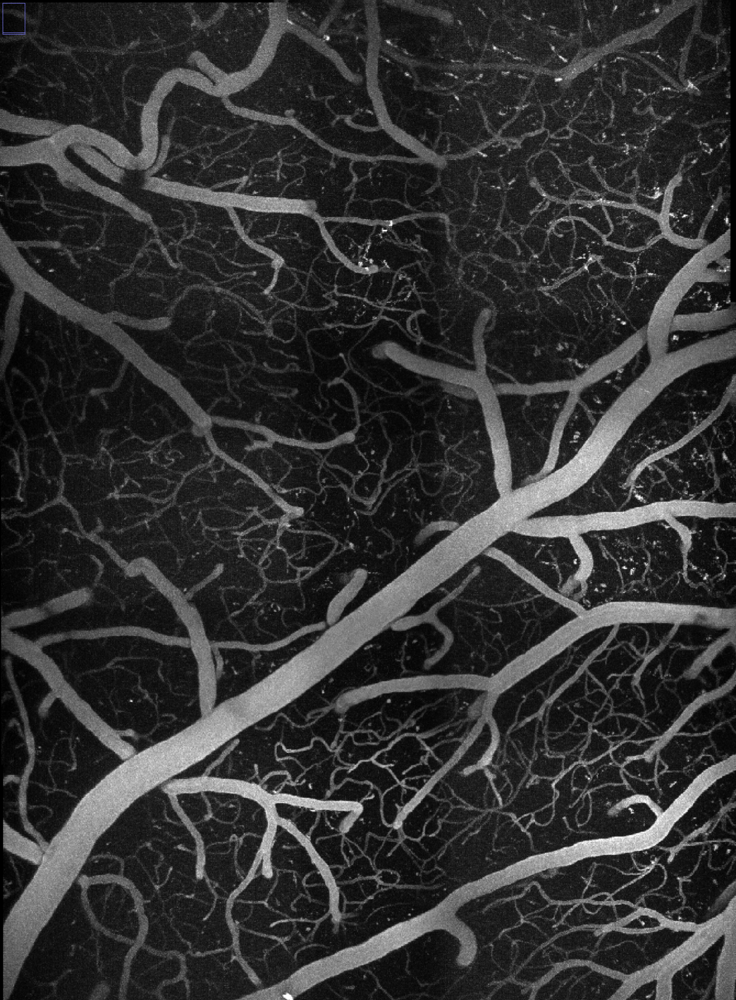|

<!--Images 1-2:-->
### Wrapper Script
Wrapper scripts (e.g. [Example 1](https://github.com/UTFOIL/Vectorization-Public/blob/master/source/vectorization_script_2017MMDD_TxRed_chronic.m), [Example 2](https://github.com/UTFOIL/Vectorization-Public/blob/master/source/vectorization_script_michael.m), ...) are useful for recording and rerunning the input parameters that were used (image locations, resolutions, etc.), as well as re-running a subset (e.g. starting with ```'vertices'``` or ```'edges'```) of the workflows. The vectorization software allows the user to pick up in the middle or re-run parts of the vectorization with different parameters or curations. Wrapper scripts are not required, as all of the input parameters and image files and locations are automatically saved in the output ```batch_*``` folder.

**Image A Input File Location Selection**| **Starting Workflow Step Selection**
:---: | :---:
|

## Energy Image
Default Energy Filtering processing parameters (purely Gaussian kernel) will work well for the images demonstrated here. If instead of the lumen, the vessel wall is illuminated, try starting with an 80/20 Gaussian/Ideal mixture, and a 50/50 annular/spherical ratio. After running the first step (```'energy'```) of the SLAVV workflows, vessels in the requested size range should have dark centerlines in the "Energy" Image.

#### Minimum intensity projection of the first 100 microns of each the three Energy-Filtered images:
A|B|C
:---: | :---: | :---:
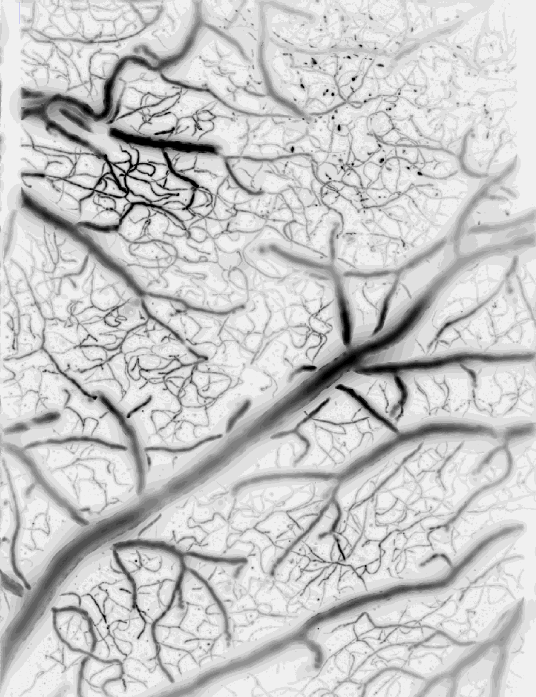||

## GCI Overview
The Graphical Curator Interface (GCI, shown below) has four windows (starting in top right and moving counter-clockwise):
1. [Volume Map](#Volume-Map)
2. [Volume Display](#Volume-Display)
3. [Intensity Histogram](#Intensity-Histogram)
4. [Energy Histogram](#Energy-Histogram)

### Anatomy of the GCI
A|B|C
:---: | :---: | :---:
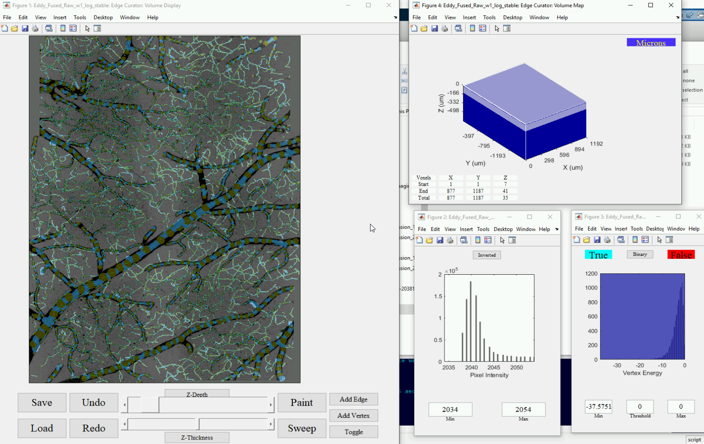||

### Volume Map
The **Volume Map** window shows the user:
- the current 3D field of view (FOV) by highlighting the 2D projections on the face of the box,
- The dimensions of the entire 3D volumetric image on the axes of the box in real spatial dimensions,
- The voxel coordinates and total number of voxels in all 3 dimensions of the current FOV in a table, and
- The volumes of influence of the previously applied threshold by painting red on the faces of the box.

### Volume Display
The **Volume Display** window shows the user:
- A maximum intensity projection of the original image and overlayed vetors in the current 3D FOV,
- The relative depth and thickness of the 2D projection displayed using the two sliders ("Depth" and "Thickness"), and
- Which vector objects in the current field of view are status true (color:blue) or false (color:red).

The **Volume Display** window gives the user control over the current FOV:
- pan vertically and horizontally using the MATLAB panning tool for plots,
- zoom vertically and horizontally using the MATLAB magnifying glass for plots,
- navigate into/out-of the page using the depth scrollbar, and
- Increase/decrease the thickness of the FOV in the depth dimension.

The **Volume Display** window also gives the user control over the direction of projection for the displayed MIP, (i.e. permute X, Y, and Z dimensions; change X or Y to the depth dimension (instead of Z)).

The **Volume Display** window gives the user vector object classification ("Toggling") ability to:
- (for vertices and edges)
  - point-and-click individual object to swap its true/false status (blue/red color) and
- (just for vertices)
  - drag a box around a group of objects to change all of them to status:true/false (color:blue/red).

### Intensity Histogram
The **Intensity Histogram** window shows the user the distribution of pixel-intensities in the FOV, allowing the user to:
- set brightness and contrast for the underlying original image, and
- toggle the dispaly mode between "original" and "inverted" for the underlying original image.

### Energy Histogram
The **Energy Histogram** window shows the user the distribution of vector-energies in the FOV, allowing the user to:
- set brightness and contrast of these objects accordingly,
- toggle the display mode between the "Graded" and "Binary" versions of the vector object brightnesses, and
- Set the Energy threshold value, assigning all vectors above that Energy value in the current FOV to false.

Note: the example curator screenshot shown in the "Anatomy of the GCI" image above is how the curator looks when the user first opens the edge objects for Image A. The vectors shown are the uncurated/unedited (no red in Volume Map or Display) automatic output of the new (unreleased) version of the Edge Extraction step of SLAVV.

<!--Images 10's:-->
## Vertex Curation
After the vertices are automatically extracted (as local minima) from the Energy Image, the user can curate these vertex objects. Vertices have both point-location and radial-sizing components, and should be considered status:true (color:blue) when both the location and size match a vessel in the underlying original image. The user can curate (classify as true/false status) the vertices using local thresholding as well as point-and-click toggling. 
### Vertex Global thresholding
To select a threshold, use the middle text-entry box in the Energy Histogram window labeled "Threshold." Try to choose a threshold that ensures high sensitivity (i.e. leave most vertices blue, even if they are false positives), but removes the many vertices in the extravascular regions of the image (owing to image noise).
#### Global Threshold Selection
|A|B|C
|:---: | :---: | :---:
|Before Thresholding||
|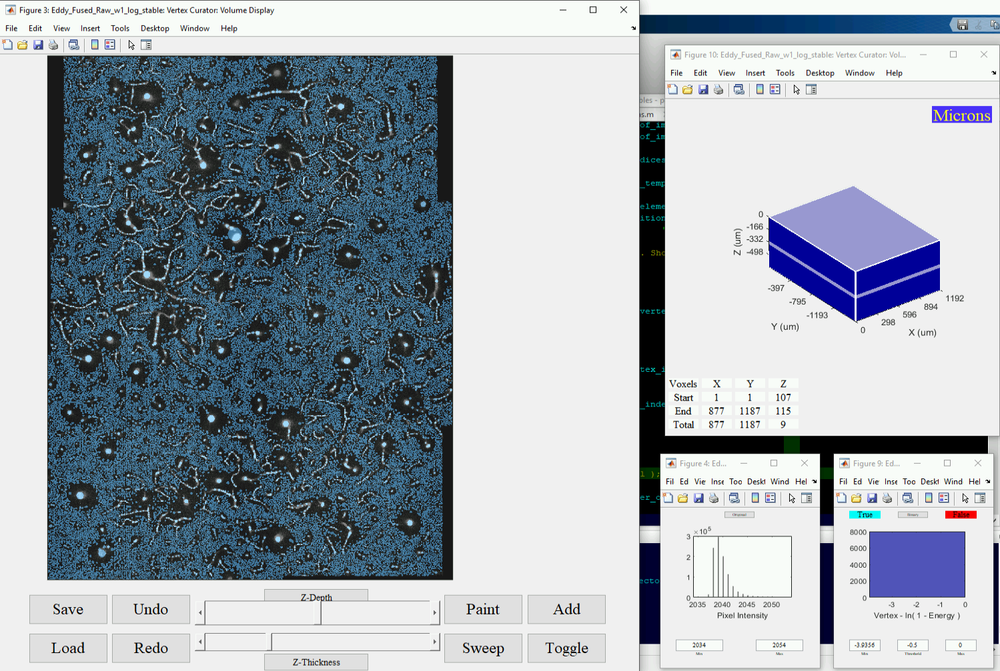||
|After Thresholding||
||||

Extend the thickness of the current field of view using the "Thickness" slider to span the entire depth of the image stack in order to apply the threshold to the entire image (globally).
#### Global Threshold Application
A|B|C
:---: | :---: | :---:
Full-Depth FOV || Partial-Depth FOV
||
<!--Full FOV
-->

### Display Options
Use the display options on the Intensity and Energy Histogram windows to better inspect the effect of the threshold.
#### "Inverted" Original Image Intensity Option
|A|B|C
|:---: | :---: | :---:
|||

#### "Graded" Vertex Display Option
|A|B|C
|:---: | :---: | :---:
|||

<!--
|||
|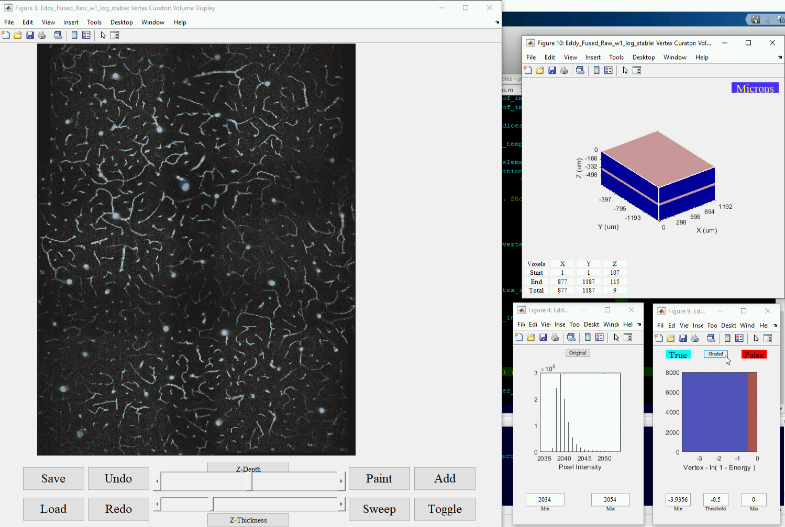||
||||-->


<!--||
||
||-->
<!--Images 20's:--> 
### Vertex Local Thresholding
After making a low specificity global threshold, navigate to the brighter regions of the original image to apply more specific local thresholds.
#### Local Threshold Selection
|A|B|C
|:---: | :---: | :---:
||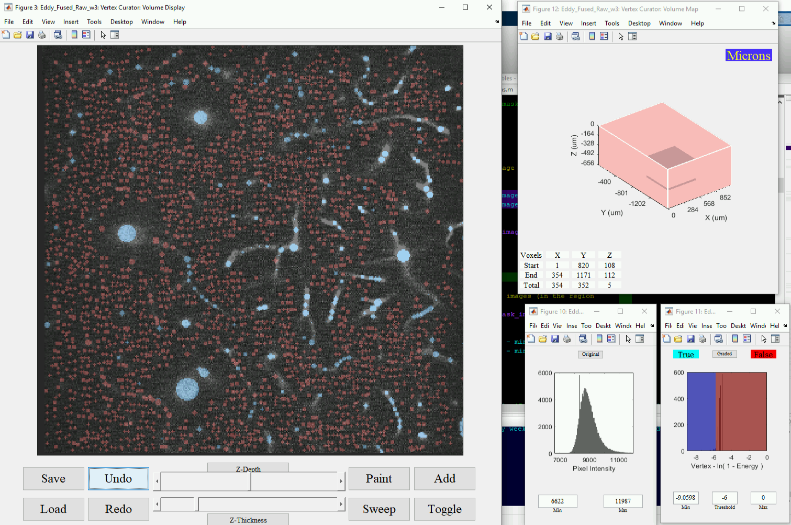|
<!--[](20.png)-->
Extending the depth in this FOV allows the user to apply this local threshold across all image slices.
#### Local Threshold Application
A|B|C
:---: | :---: | :---:
Before Thresholding|After Thresholding|
||
<!--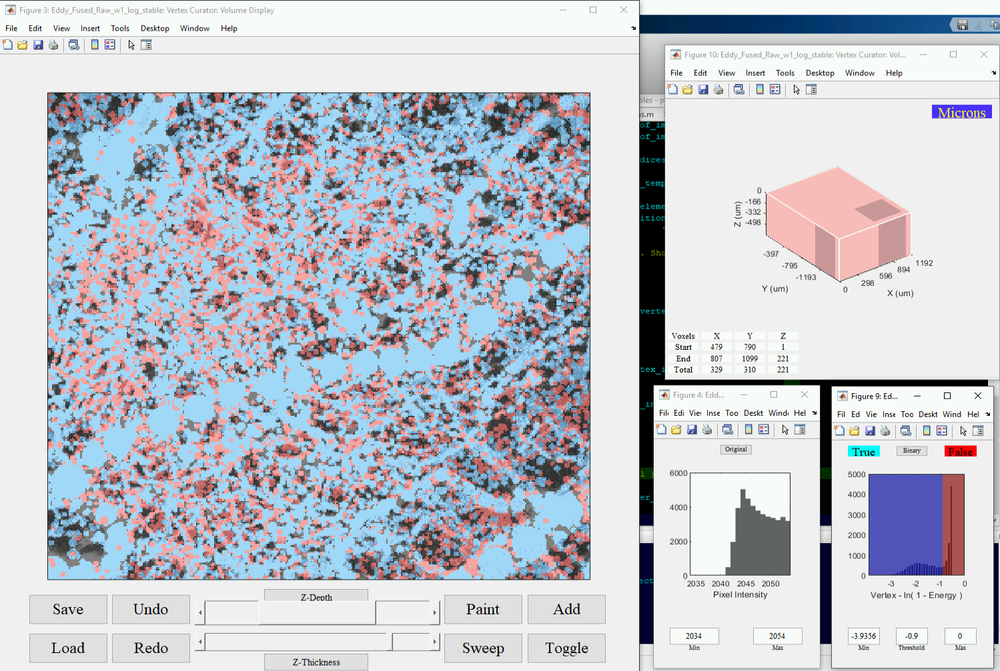||-->

### Sweeping
The Sweep button on the Volume Display removes the false objects from the display and histogram making it easier to see other objects.
#### Removing status:false (color:red) vertices from the display and histograms
|A|B|C
|:---: | :---: | :---:
||Before Sweeping|
|||
||After Sweeping|
|||

### Vertex Toggling
Some vertices cannot be easily removed by thresholding and need to be selected individually by point-and-click or dragging a box over them.
#### Group Toggling to Status:False (Color:Red) of Vertices on Vessel Border
|A|B|C
| :---: | :---: | :---:
||Before Toggling|
||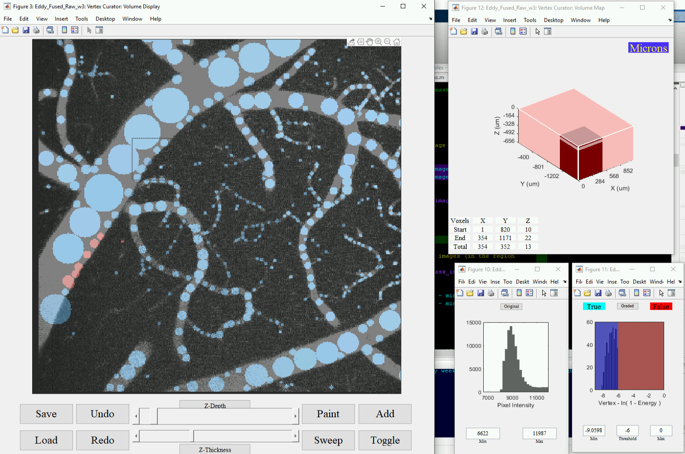|
||After Toggling|
|||


<!--|||
|||-->

<!--Image  30's: -->
### Final Curated Vertex Set
These are the final curated vertex sets that were passed to the Edge Extraction step.
|A|B|C
| :---: | :---: | :---:
|Full FOV|Full FOV|
|||

|A|B|C
| :---: | :---: | :---:
||Partial FOV|
|||

<!--Images 40's:-->
## Edge Curation
After the edges are automatically extracted (by tracing the Energy Image with the vertices as termini), the user can curate these edge objects. Edges consist of ordered lists of locations and sizes, which connect one vertex to another along the path of the edge. Edges should be considered status:true (color:blue) when both the locations and sizes match a vessel segment in the underlying original image. The user can curate (classify as true/false status) the edges using local thresholding as well as point-and-click toggling.
### Volume Navigation
Use the "Depth" slider to navigate deeper into the volume. Select in the margin of the slider to move the current FOV to the next adjacent, non-overlapping, FOV.
#### Fly-through of the (uncurated/unedited) output of the new (unreleased) version of the automated Edge Extraction step of SLAVV. 
Note: red-penned circles are pointing out missing parts of the vectorization that need to be manually added.
|A|B|C
| :---: | :---: | :---:
|||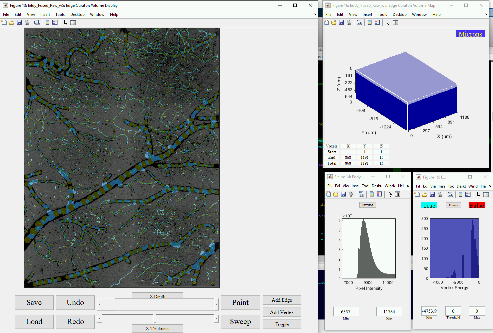
|||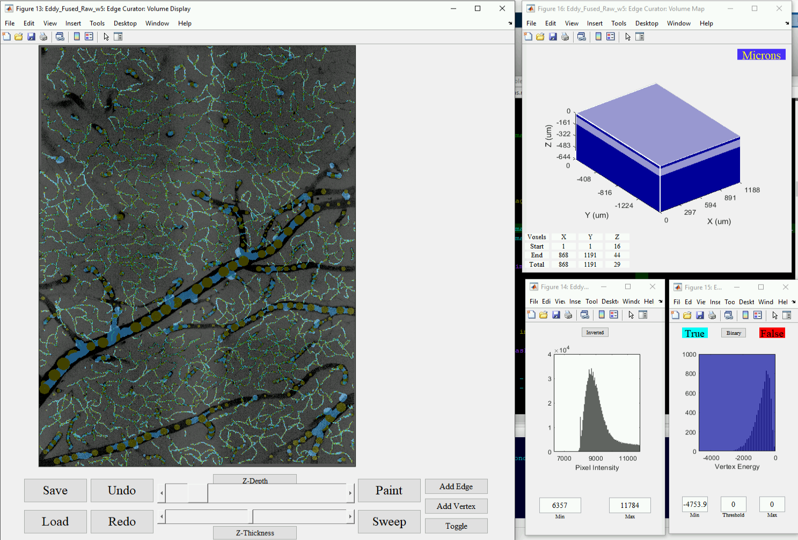
|||
|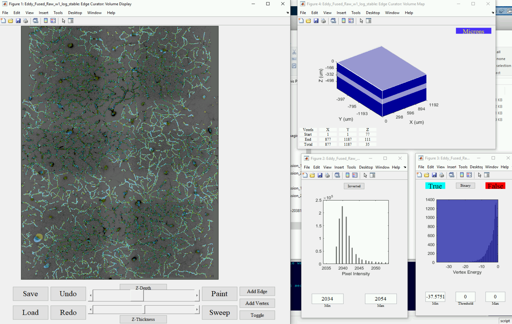||
|||
|||
|||
|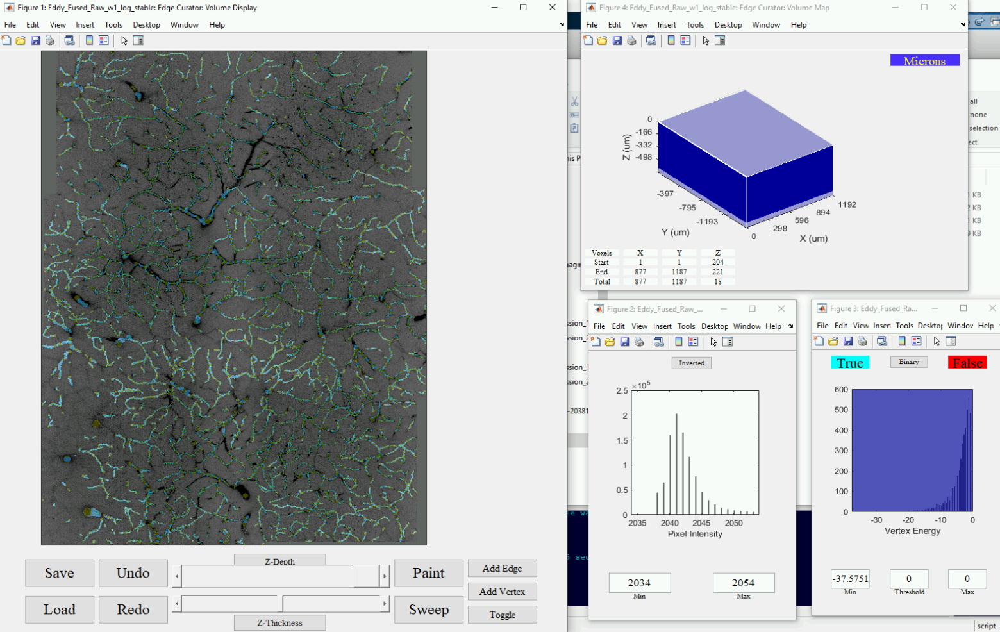||

### Edge Thresholding
Use the "Threshold" text-entry box in the Energy Histogram window to set a threshold. Try to choose a threshold that labels edge objects outside of vessels as status:false (color:red).  
#### Global Edge Thresholding 
|A|B|C
| :---: | :---: | :---:
||Before Thresholding
||
||After Thresholding and Sweeping
|||

<!--
|||
|||
|||
|||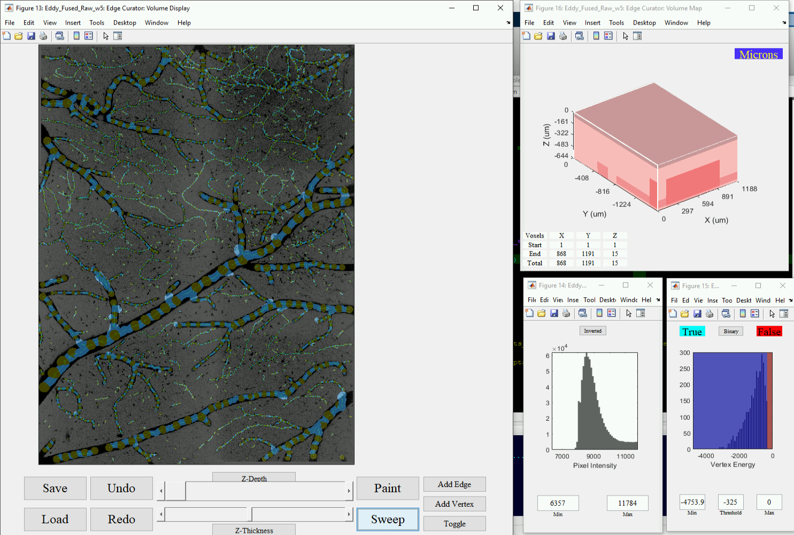
|||
|||-->

#### Local Edge Thresholding
|A|B|C
| :---: | :---: | :---:
|||

### Orthogonal Views
Use the "Z-Depth" or "Z-Thickness" button in the Volume Display window to change the direction of projection of the displayed MIP. Use an X or Y projection to get a better perspective on the penetrating vessels that are aligned with the Z-axis.
#### Spotting missing vectors in descending vessels using a X- and Y-projected display volume
Note: red-penned circles are pointing out missing parts of the vectorization that need to be manually added.

A|B|C
:---: | :---: | :---:
Thin Y-Projected FOV||
||
Thick Y-Projected FOV||
||
Thin X-Projected FOV||
||
Thick X-Projected FOV (annotated)||
||
<!--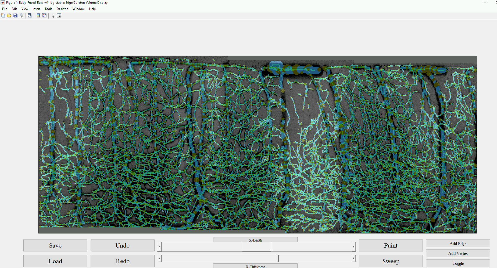||-->
### Edge Addition
Use the "Add" Button in the Volume Display window to add edges to existing vertices (shown in gold during edge curation). Select two vertices, one after the other, to connect them with a straight edge, which interpolates the vertex sizes across its length. Note: after selecting the add button, any vertices in the FOV that do not yet have connected edges (and are normally hidden to the user) will also be shown to the user in the Display Volume to serve as possible termini for the added edge.

A|B|C
:---: | :---: | :---:
||
||
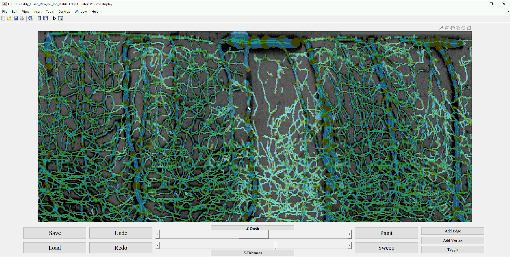||
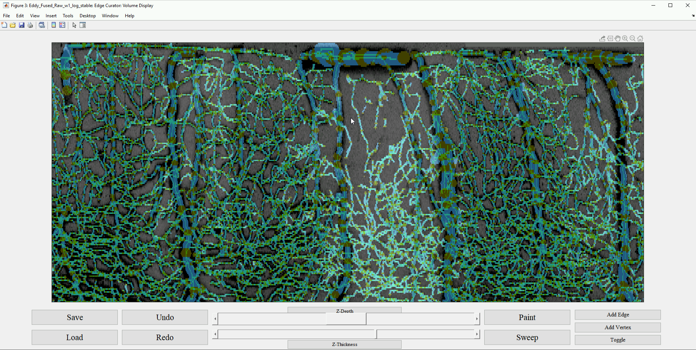||

### Edge Toggling
Use the "Toggle" button in the Volume Display window to point-and-click edges to toggle their true/false status. 

A|B|C
:---: | :---: | :---:
||
||

### Final Curated Edge Set
This is the final curated edge set that was passed to the Network Organization step and represented in the [histograms](#histograms) and [visualizations](visualizations).
#### MIP over the whole volume with graded edge color weighting.  
|A|B|C
| :---: | :---: | :---:
|||

## Projections
Maximum intensity projection outputs from the middle (1/3 in all 3 dimensions) of the vectors overlaying the image.
#### Color-Coded Projections
Note: from left to right, the color coding is: strands (random color for each), depth, and direction.

A|B|C
:---: | :---: | :---:
||

|A|B|C
|:---: | :---: | :---:
|||

|A|B|C
|:---: | :---: | :---:
|||

## Histograms
Lateral area- or strand-weighted histograms of various statistics of interest from the vectorized vascular network in the input image can be used to analyze the anatomy in question.
#### Network Histograms
Note: Strands are vessel segments that connect bifurcations/endpoints to bifurcations/endpoints. The left histograms are strand-weighted, the right lateral area-.
A|B|C
:---: | :---: | :---:
||

|A|B|C
|:---: | :---: | :---:
|||

|A|B|C
|:---: | :---: | :---:
|||

## Visualizations
Use the ```network_*.vmv``` file output in the ```vectors``` directory of the ```batch_*``` folder to export the vascular vectorization to the [VessMorphoVis](https://github.com/BlueBrain/VessMorphoVis) plugin to [Blender](https://www.blender.org/) to visualize the network in 3D with lighting and color-coding.  

#### VessMorphoVis Plugin to Blender: Loading ```*.vmv``` Output from SLAVV


#### Six Faces of the Box Volume 
Note: colorful images are coded by vessel radius.
|A|B|C
|:---:|:---:|:---:
|||
|||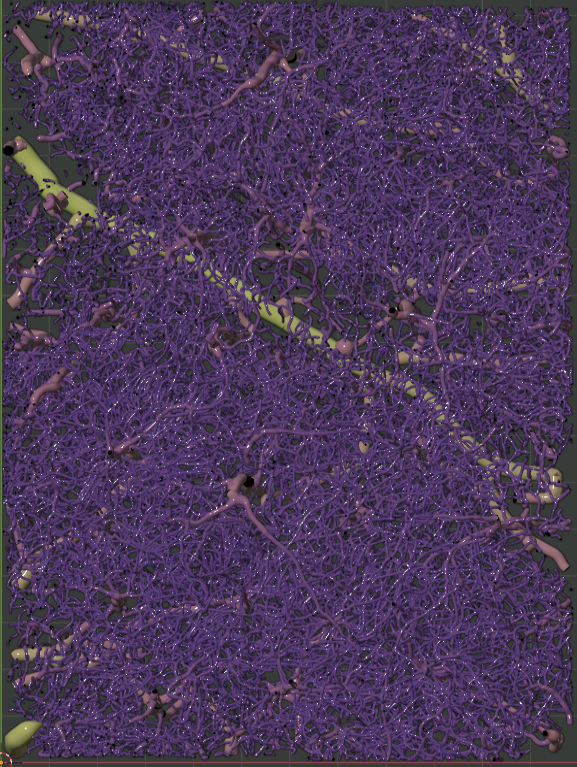
|||
|||
|||
|||

|A|B|C
|:---:|:---:|:---:
||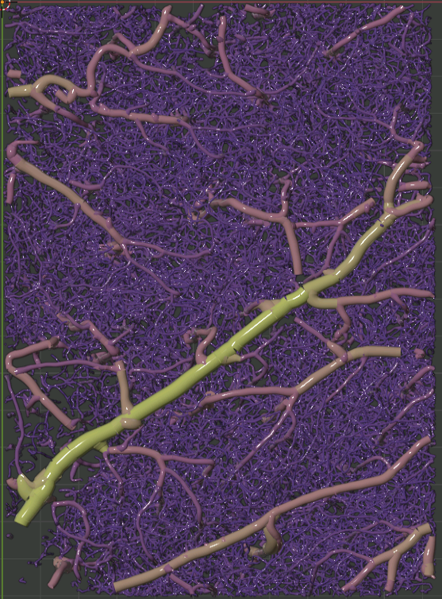|
||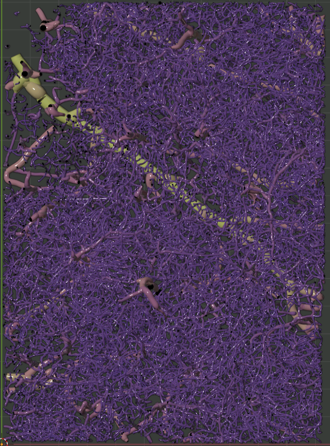|
|||
|||
|||
|||

<!--

-->
#### Lighting and Color Options Built-into VessMorphoVis
A|B|C
:---: | :---: | :---:
||
||
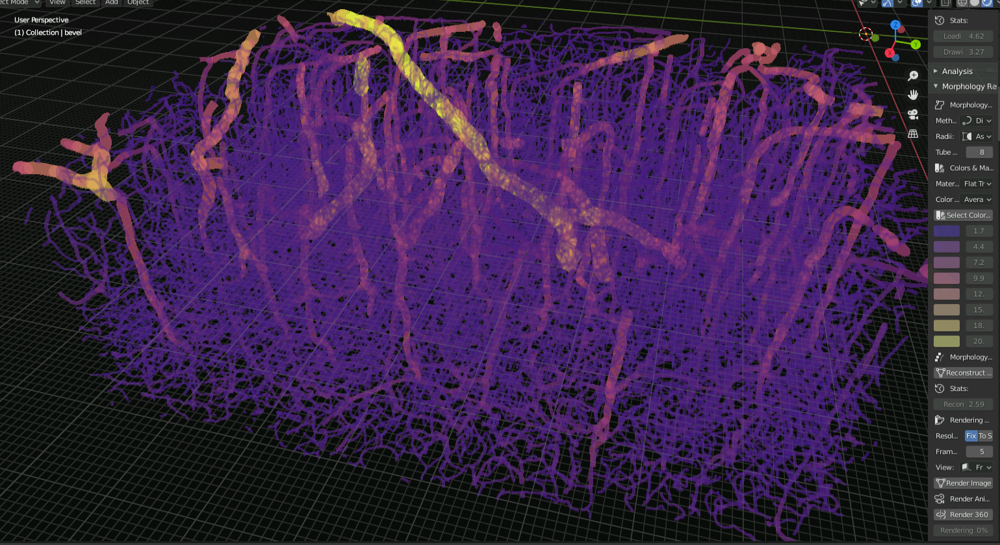||
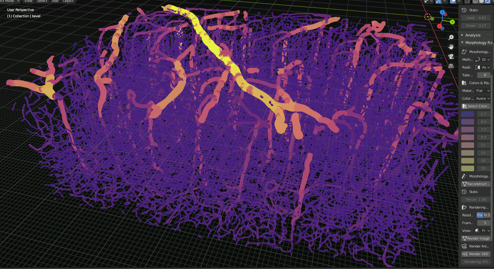||
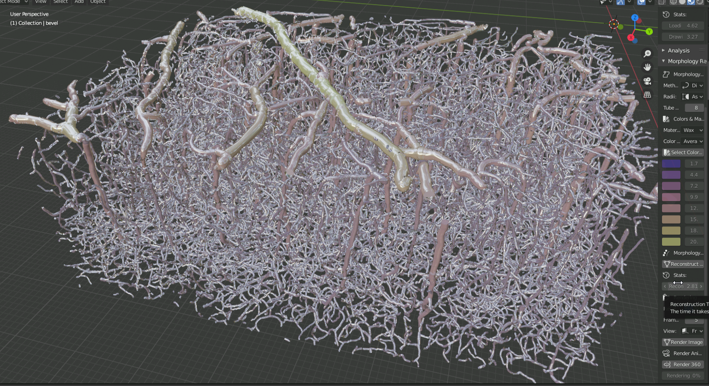||
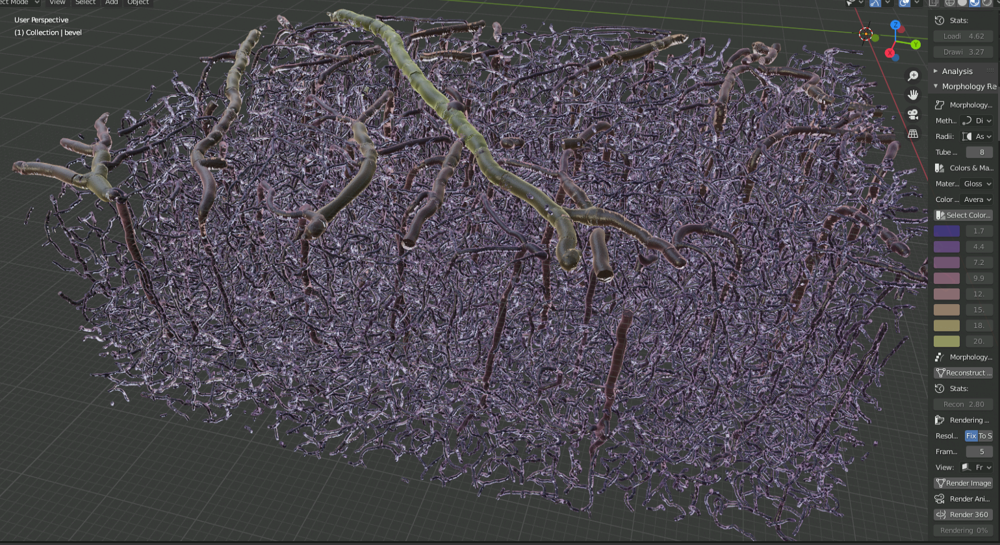||
||
||
<!---->
